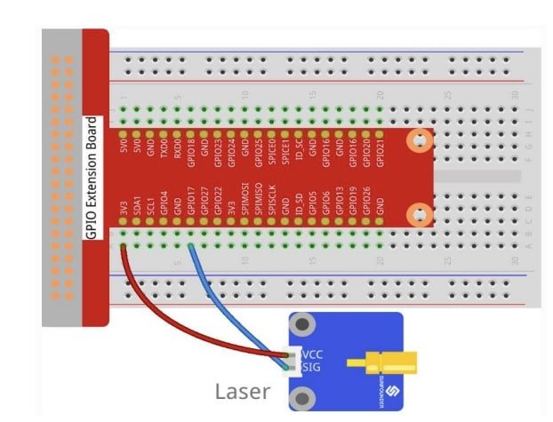
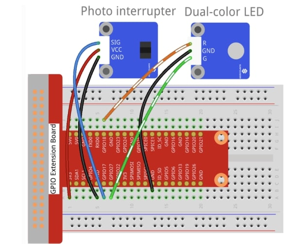

# 🔌 Circuit Diagrams & Wiring Guide

This document provides detailed wiring instructions for all sensors in the Raspberry Pi GPIO Sensors Laboratory.

## 📸 Visual Circuit Examples

Before diving into the detailed wiring instructions, check out these **actual circuit photos** showing professional setups:

<div align="center">

| Sensor | Circuit Photo | Key Components |
|--------|---------------|----------------|
| **Dual-Color LED** |  | GPIO extension board, breadboard, LED module |
| **Push Button** |  | Button module, LED indicators, pull-up resistors |
| **Ultrasonic** |  | HC-SR04 sensor, 5V power, trigger/echo pins |
| **RGB LED** |  | Common cathode RGB, current limiting resistors |
| **Touch Sensor** |  | Capacitive touch module, feedback LEDs |
| **Hall Effect** |  | Magnetic sensor, indicator LEDs |
| **Tilt Sensor** |  | Gravity switch, status indicators |
| **Laser Module** |  | **⚠️ SAFETY CRITICAL** - Laser diode module |
| **Photo Interrupter** |  | Optical sensor, infrared LED/phototransistor |

</div>

> 💡 **Pro Tip**: These photos show the **exact same GPIO extension board setup** used in all configurations, making it easy to replicate any circuit.

## 📋 Components List

### Required Components
- 1x Raspberry Pi (any model with 40-pin GPIO header)
- 1x Breadboard (830 points recommended)
- Jumper wires (male-to-male, male-to-female)
- Resistors: 220Ω (for LEDs), 10kΩ (pull-up, if needed)

### Sensors & Modules
- 1x Push Button
- 1x RGB LED (common cathode) or 3x individual LEDs
- 1x Hall Effect Sensor (e.g., A3144)
- 1x Laser Module (KY-008)
- 1x Photo Interrupter (e.g., ITR-9608)
- 1x Tilt Sensor (SW-520D)
- 1x Touch Sensor (TTP223)
- 1x Ultrasonic Sensor (HC-SR04)

## 🎯 Pin Assignment Table

| Component | Raspberry Pi Pin | GPIO Number | Pin Type | Notes |
|-----------|------------------|-------------|----------|-------|
| **Digital Sensors** | | | | |
| Button | Pin 11 | GPIO 17 | Input (Pull-up) | Normally closed to GND |
| Touch Sensor | Pin 15 | GPIO 22 | Input | Digital output sensor |
| Hall Sensor | Pin 16 | GPIO 23 | Input (Pull-up) | Digital magnetic sensor |
| Tilt Sensor | Pin 11 | GPIO 17 | Input (Pull-up) | Gravity switch |
| Photo Interrupter | Pin 11 | GPIO 17 | Input (Pull-up) | Light barrier |
| **LED Outputs** | | | | |
| Red LED | Pin 12 | GPIO 18 | Output (PWM) | Current limiting resistor |
| Green LED | Pin 13 | GPIO 27 | Output (PWM) | Current limiting resistor |
| Blue LED | Pin 33 | GPIO 13 | Output (PWM) | Current limiting resistor |
| **Special Modules** | | | | |
| Laser Module | Pin 18 | GPIO 24 | Output | **SAFETY CRITICAL** |
| Ultrasonic TRIG | Pin 22 | GPIO 25 | Output | Trigger pulse |
| Ultrasonic ECHO | Pin 24 | GPIO 8 | Input | Echo reception |
| **Power** | | | | |
| 3.3V Supply | Pin 1 | 3.3V | Power | For 3.3V sensors |
| 5V Supply | Pin 2 | 5V | Power | For 5V sensors |
| Ground | Pin 6, 9, 14, 20 | GND | Ground | Multiple GND connections |

## 🔧 Individual Sensor Wiring

### 1. Push Button (button.py)
```
Raspberry Pi          Push Button
┌─────────────┐      ┌─────────────┐
│ Pin 11      │────→ │ Terminal 1   │
│ (GPIO 17)   │      │             │
│             │      │ Terminal 2   │ ←── GND (Pin 6)
│ Pin 12      │────→ │ LED Red (+)  │
│ (GPIO 18)   │      │             │
│ Pin 13      │────→ │ LED Green (+)│
│ (GPIO 27)   │      │             │
│ GND (Pin 6) │────→ │ LED Common(-)│
└─────────────┘      └─────────────┘
```

### 2. RGB LED (rgb_led.py)
```
Raspberry Pi          RGB LED (Common Cathode)
┌─────────────┐      ┌─────────────┐
│ Pin 32      │──220Ω→│ Red Anode    │
│ (GPIO 12)   │      │             │
│ Pin 36      │──220Ω→│ Green Anode  │
│ (GPIO 16)   │      │             │
│ Pin 38      │──220Ω→│ Blue Anode   │
│ (GPIO 20)   │      │             │
│ GND (Pin 34)│────→ │ Cathode(-)   │
└─────────────┘      └─────────────┘
```

### 3. Ultrasonic Sensor (ultrasonic.py)
```
Raspberry Pi          HC-SR04
┌─────────────┐      ┌─────────────┐
│ 5V (Pin 2)  │────→ │ VCC         │
│ GND (Pin 6) │────→ │ GND         │
│ Pin 11      │────→ │ TRIG        │
│ (GPIO 17)   │      │             │
│ Pin 12      │────→ │ ECHO        │
│ (GPIO 18)   │      │             │
└─────────────┘      └─────────────┘
```

### 4. Hall Effect Sensor (hall.py)
```
Raspberry Pi          A3144 Hall Sensor
┌─────────────┐      ┌─────────────┐
│ 3.3V (Pin 1)│────→ │ VCC         │
│ GND (Pin 6) │────→ │ GND         │
│ Pin 11      │────→ │ OUT         │
│ (GPIO 17)   │      │             │
│ Pin 12      │────→ │ LED Red (+) │
│ (GPIO 18)   │      │             │
│ Pin 13      │────→ │ LED Green(+)│
│ (GPIO 27)   │      │             │
└─────────────┘      └─────────────┘
```

### 5. Laser Module (laser.py)
```
⚠️ SAFETY WARNING: Never look directly into laser!

Raspberry Pi          KY-008 Laser
┌─────────────┐      ┌─────────────┐
│ 3.3V (Pin 1)│────→ │ VCC         │
│ GND (Pin 6) │────→ │ GND         │
│ Pin 11      │────→ │ Signal      │
│ (GPIO 17)   │      │             │
└─────────────┘      └─────────────┘
```

### 6. Touch Sensor (touch.py)
```
Raspberry Pi          TTP223 Touch
┌─────────────┐      ┌─────────────┐
│ 3.3V (Pin 1)│────→ │ VCC         │
│ GND (Pin 6) │────→ │ GND         │
│ Pin 11      │────→ │ OUT         │
│ (GPIO 17)   │      │             │
│ Pin 12      │────→ │ LED Red (+) │
│ (GPIO 18)   │      │             │
│ Pin 13      │────→ │ LED Green(+)│
│ (GPIO 27)   │      │             │
└─────────────┘      └─────────────┘
```

### 7. Tilt Sensor (tilt.py)
```
Raspberry Pi          SW-520D Tilt
┌─────────────┐      ┌─────────────┐
│ Pin 11      │────→ │ Terminal 1   │
│ (GPIO 17)   │      │             │
│ GND (Pin 6) │────→ │ Terminal 2   │
│             │      │             │
│ Pin 12      │────→ │ LED Red (+) │
│ (GPIO 18)   │      │             │
│ Pin 13      │────→ │ LED Green(+)│
│ (GPIO 27)   │      │             │
└─────────────┘      └─────────────┘
```

### 8. Photo Interrupter (photo_interrupter.py)
```
Raspberry Pi          ITR-9608
┌─────────────┐      ┌─────────────┐
│ 3.3V (Pin 1)│────→ │ LED Anode   │
│ Pin 11      │←──── │ Phototrans C│
│ (GPIO 17)   │      │             │
│ GND (Pin 6) │────→ │ LED Cathode │
│             │    ├─│ Phototrans E│
│ Pin 12      │────→ │ LED Red (+) │
│ (GPIO 18)   │      │             │
│ Pin 13      │────→ │ LED Green(+)│
│ (GPIO 27)   │      │             │
└─────────────┘      └─────────────┘
```

## 🔧 Complete Demo Circuit (demo.py)

For the comprehensive demo that uses multiple sensors simultaneously:

### Pin Assignments for Demo
```
Component            Pin    GPIO    Notes
──────────────────────────────────────────
Button               11     17      Input with pull-up
Touch Sensor         15     22      Digital input
Hall Sensor          16     23      Digital input
Laser Module         18     24      Output (SAFETY!)
Ultrasonic TRIG      22     25      Output trigger
Ultrasonic ECHO      24     8       Input echo
RGB Red              32     12      PWM output
RGB Green            36     16      PWM output  
RGB Blue             38     20      PWM output
```

### Power Distribution
```
Power Rail           Connections
──────────────────────────────────
3.3V (Pin 1)        → Touch, Hall, Laser VCC
5V (Pin 2)          → Ultrasonic VCC
GND (Pin 6,9,14,20) → All sensor GND, LED cathodes
```

## ⚡ Electrical Specifications

### Voltage Levels
- **Digital Logic**: 3.3V (Raspberry Pi standard)
- **Input High**: > 2.0V
- **Input Low**: < 0.8V
- **Output High**: 3.3V
- **Output Low**: 0V

### Current Ratings
- **GPIO Output**: Max 16mA per pin
- **Total GPIO**: Max 50mA
- **LED Current**: 10-20mA (with 220Ω resistor)
- **3.3V Rail**: Max 50mA
- **5V Rail**: Depends on power supply

### PWM Specifications
- **Frequency Range**: 1Hz - 8kHz
- **Resolution**: Software-controlled
- **Duty Cycle**: 0-100%
- **Channels**: All GPIO pins capable

## 🛡️ Safety Guidelines

### Electrical Safety
1. **Always power off** Raspberry Pi before wiring
2. **Check polarity** before connecting power
3. **Use current limiting resistors** for LEDs
4. **Avoid short circuits** between power rails
5. **Double-check connections** before powering on

### Laser Safety
1. **Never look directly** into laser beam
2. **Don't point at people** or animals
3. **Use appropriate eye protection** when needed
4. **Follow local regulations** for laser devices
5. **Mount securely** to prevent accidents

### General Hardware Safety
1. **Handle components carefully** - static sensitive
2. **Use proper wire gauges** for current requirements
3. **Secure all connections** to prevent intermittent faults
4. **Label complex circuits** for maintenance
5. **Keep workspace clean** and organized

## 🔍 Troubleshooting

### Common Wiring Issues
- **No response**: Check power connections and GPIO pin assignments
- **Erratic behavior**: Verify ground connections and debouncing
- **LEDs too dim**: Check resistor values and current limits
- **Intermittent faults**: Secure all jumper wire connections

### Testing Procedures
1. **Continuity test** all connections with multimeter
2. **Voltage test** power rails (3.3V, 5V, GND)
3. **GPIO test** using `gpio readall` command
4. **Isolation test** run individual sensor scripts first

## 📚 Additional Resources

- [Raspberry Pi GPIO Pinout](https://pinout.xyz/)
- [RPi.GPIO Documentation](https://sourceforge.net/p/raspberry-gpio-python/wiki/Home/)
- [Electronic Component Datasheets](https://www.alldatasheet.com/)
- [Circuit Design Best Practices](https://www.electronics-tutorials.ws/)

---

⚠️ **Remember**: This project involves real hardware. Take appropriate safety precautions and double-check all connections before applying power. 