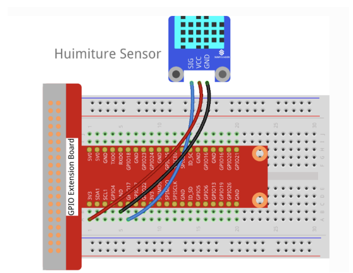
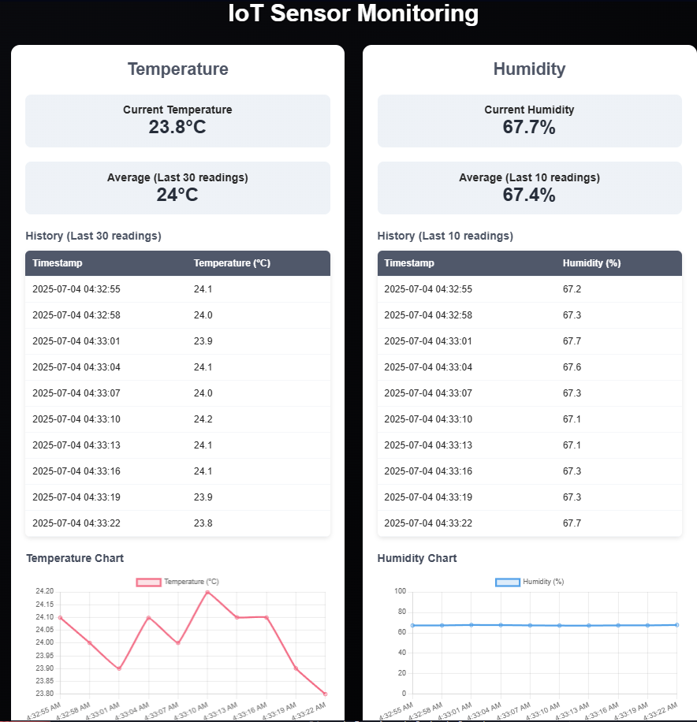

# IoT Web Monitoring System

A distributed IoT temperature and humidity monitoring system built for educational purposes (GTI 700 Lab 1).

## 📸 System Overview

### Hardware Setup

*Physical setup showing the DHT11 sensor connected to the Raspberry Pi board*

### Web Interface

*Real-time monitoring dashboard displaying temperature and humidity data with live charts*

## System Architecture

This project implements a distributed IoT monitoring system using two Raspberry Pi devices:

- **Raspberry Pi A**: Backend API server with DHT sensor interface
- **Raspberry Pi B**: Frontend web interface for data visualization

## 📁 Project Structure
```
iot-web-monitoring-system/
├── README.md                          # Main documentation
├── backend/                          # Raspberry Pi A - API Server
│   ├── package.json
│   ├── server.js
│   ├── sensor_module.js
│   ├── temp_and_hum_recorder.js      # DHT sensor interface
│   └── docs/
│       └── api_documentation.md
├── frontend/                         # Raspberry Pi B - Web Interface
│   ├── package.json
│   ├── frontend-server.js
│   └── public/
│       ├── index.html
│       ├── style.css
│       └── script.js
├── deployment/                       # Deployment guides
│   ├── setup_instructions.md
│   └── network_diagram.png
├── demo-materials/                   # Demo content
│   ├── screenshots/
│   ├── demo_video.mp4
│   └── performance_tests.md
└── docs/                            # Additional documentation
    ├── architecture.md
    └── lab_requirements.md
```

##  Features

- **Real-time monitoring** of temperature and humidity using DHT11 sensor
- **RESTful API** for sensor data access with various endpoints
- **Web dashboard** with live charts and historical data visualization
- **Data history** storage with configurable retention (720 readings default)
- **Statistical analysis** including averages and trends
- **Responsive design** for mobile and desktop viewing

##  API Endpoints

### Temperature
- `GET /capteurs/temp` - Latest temperature reading
- `GET /capteurs/temp/:n` - Last n temperature readings
- `GET /capteurs/temp/:n/moy` - Average of last n temperature readings

### Humidity
- `GET /capteurs/hum` - Latest humidity reading
- `GET /capteurs/hum/:n` - Last n humidity readings
- `GET /capteurs/hum/:n/moy` - Average of last n humidity readings

##  Technology Stack

### Backend
- **Node.js** with Express.js framework
- **node-dht-sensor** library for DHT11 sensor integration
- **CORS** enabled for cross-origin requests

### Frontend
- **Vanilla JavaScript** with Chart.js for data visualization
- **Express.js** static file server
- **Modern CSS** with responsive design

## Installation & Setup

### Prerequisites
- Node.js (v14 or higher)
- Raspberry Pi with GPIO access (for backend)
- DHT11 temperature/humidity sensor

### Backend Setup (Raspberry Pi A)
```bash
cd backend/
npm install
npm start
```

### Frontend Setup (Raspberry Pi B)
```bash
cd frontend/
npm install
npm start
```

The backend API will be available at `http://localhost:8080`
The frontend web interface will be available at `http://localhost:8889`

## 📡 Hardware Configuration

- **DHT11 Sensor**: Connected to GPIO pin 17
- **Sensor Type**: DHT11 (Type 11)
- **Reading Interval**: 3 seconds
- **Data Retention**: 720 readings (1 hour at 5-second intervals)


## 📈 Performance

- **Sensor Reading Frequency**: Every 3 seconds
- **API Response Time**: < 10ms (typical)
- **Data Storage**: In-memory (720 readings max)
- **Web Interface**: Real-time updates every 5 seconds

## 🔒 Security Considerations

- CORS enabled for development purposes
- No authentication implemented (academic project)
- Local network deployment recommended